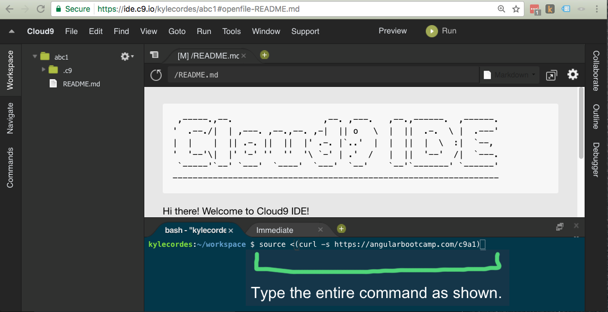

# Angular Boot Camp - Learning Materials

http://angularbootcamp.com/

## Welcome

Welcome to the Oasis Digital Angular Bootcamp

While we wait for others to arrive you can get a jumpstart by performing the
following steps in the Cloud 9 command line:

## Online (Cloud 9 IDE) Development

The fastest way to get started, without any local tool installation,
is to set up a Cloud 9 instance (as described in the pre-class
information for online classes), then run this command (the
**entire** line) in the Command Line section of your Cloud 9
workspace:

```
source <(curl -s https://angularbootcamp.com/c9a1)
```

This will install and configure the software, and start "live-server"
and "json-server" to serve the class content and demo API.

See the file `entering-the-cloud-9-command.png` to clarify where to type
the above command:



This will download the class curriculum material and launch a Web server, ready
to begin class. If you inadvertently stop that Web server, you can restart it:

```
cd ~/workspace/learn
npm start
```

To see the material, open it in another browser tab:

http://yourWorkspaceName-yourUsername.c9users.io/

-----------------------------------------------------------------------------------

## "Learn" - the first part of the class

This is a standalone, ready to use set of files, sufficient for the first portion of the class.
The only tools truly necessary for this portion are a text editor and a Web server.
See the readme file inside for instructions on how to launch a Web server,
or use any Web server you have handy.

# Welcome to Angular Boot Camp Agenda

The agenda varies over time; your instructor will adjust it to match
the needs of the class and the ongoing changes in the AngularJS
ecosystem. Here is a rough idea of the overall agenda:

* Basics of AngularJS - core vocabulary to build components
* Structuring an AngularJS application
* Development / build tooling
* Advanced and varied features (that are okay to learn later)
* Examples, details, surrounding ecosystem

## Workshops

The instructor may have changes to the workshops, as our curriculum is
under continuous improvement and is adjusted for the needs of each
class.
