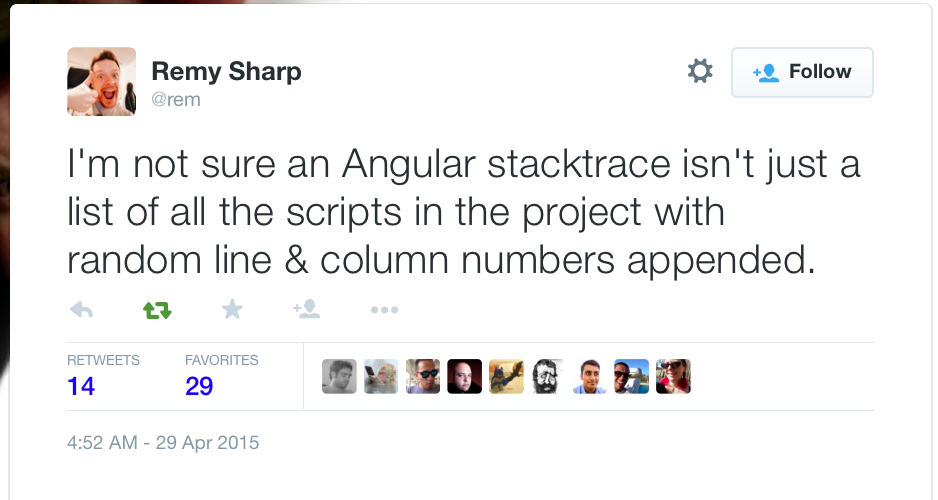

# Developing and Debugging

Develop in Chrome, but test in everything.

Keep the Chrome DevTools Console open, since that's where any errors or log messages will be displayed.

Check the "Disable cache (while DevTools is open)" checkbox, and then leave the DevTools open.

## ngInspector

Install ngInspector: <http://ng-inspector.org>

Real-time, ambient information about currently running Angular application.

Shows scopes and associated controllers, directives.

## Batarang

Install Batarang (Stable): <https://chrome.google.com/webstore/detail/angularjs-batarang-stable/niopocochgahfkiccpjmmpchncjoapek>

Recommend avoiding the official Batarang for now -- "On December 9th, the official AngularJS Batarang extension broke the internet. This is the previous and stable version."

Performance tab to see what's eating all of your time.

Options can highlight scopes, bindings, apps. ngInspector is generally better for this, though.

Batarang dependencies chart looks neat, but isn't all that useful.

## ngStats

"Little utility to show stats about your page's angular digest/watches." <https://github.com/kentcdodds/ng-stats>

ng-stats demo: <http://kentcdodds.com/ng-stats/>

## Logging

Avoid `console.log()` -- can cause problems in IE 8/9. Use `$log` instead.

`$log` is an injectable AngularJS service, so you know where it's being used.

Provides more granular methods than just "log" -- debug, info, warn, error.

Can be configured via `$logProvider`.

Can be decorated to enhance its capabilities, like shipping client-side logs back to a server.

<https://twitter.com/rem/status/593352056884330496>

